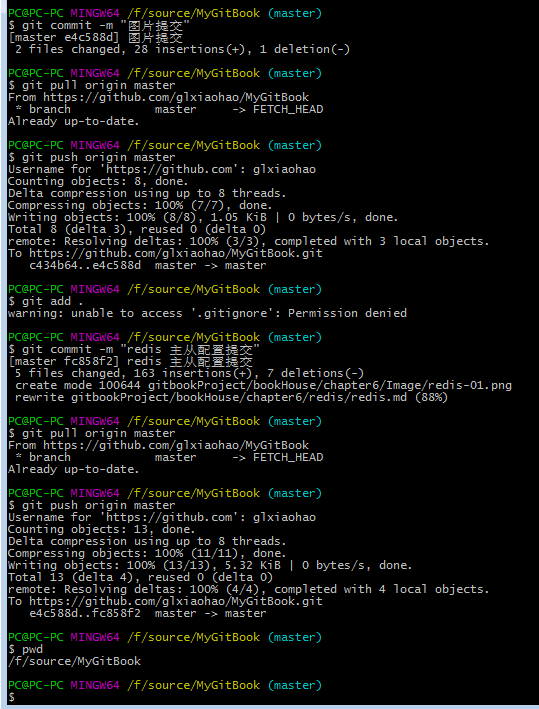
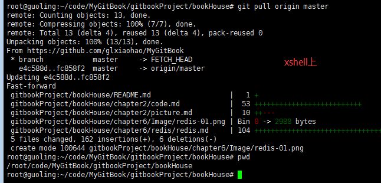

# Introduction

ctrl + alt + v （先用QQ剪切想要的图片）拷贝图片到md文件
```
glxiaohao
glxiaohao_123
http://gl.yystudying.com:4000/chapter6/redis/redis.html
```



cd /root/code/MyGitBook/gitbookProject/bookHouse
git pull origin master


