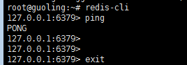

# reids

redis主从服务器搭建，保证若主服务器挂了，从服务器上有着和主服务器一模一样的数据供用户访问.

## 1. ubuntu 下安装redis
```
apt-get update;apt-get install redis-server
```

## 2. 测试是否安装成功
```
redis-cli
ping

如果出现PONG,则表示安装成功
```
### 效果图



### 修改主服务器(118.190.159.29)redis.conf文件
```
绑定ip：如果需要远程访问，可将127.0.0.1注释掉，可以选择绑定一个真实ip
1. cd /etc/redis
2. vi redis.conf
3. 将bind 127.0.0.1注释掉 改为 bind 0.0.0.0
4. 端口，默认为6379 `port 6379`
```
### 主要命令:
```bash
redis-cli shutdown
redis-server /etc/redis/redis.conf 
lsof -i:6379
redis-cli
set name "guoling"
exit 或者 ctrl + c 都是退出redis-cli
```


### 修改从服务器(123.56.30.193)redis.conf文件
```
绑定ip：如果需要远程访问，可将127.0.0.1注释掉，可以选择绑定一个真实ip
1. cd /etc/redis
2. vi redis.conf
3. 将bind 127.0.0.1注释掉 改为 bind 0.0.0.0
4. 添加 slaveof 118.190.159.29 6379
```
### 主要命令:
```bash
redis-cli shutdown
redis-server /etc/redis/redis.conf 
lsof -i:6379
redis-cli
get name
exit 或者 ctrl + c 都是退出redis-cli
```

### 编辑从服务器上的 vi redis.conf
```
daemonize yes
pidfile /var/run/redis/redis-server.pid
port 6379
bind 0.0.0.0
timeout 0
tcp-keepalive 0
loglevel notice
logfile /var/log/redis/redis-server.log
databases 16
save 900 1
save 300 10
save 60 10000
stop-writes-on-bgsave-error yes
rdbcompression yes
rdbchecksum yes
dbfilename dump.rdb
dir /var/lib/redis
slaveof 118.190.159.29 6379
slave-serve-stale-data yes
slave-read-only yes
repl-disable-tcp-nodelay no
slave-priority 100
appendonly no
appendfilename "appendonly.aof"
appendfsync everysec
no-appendfsync-on-rewrite no
auto-aof-rewrite-percentage 100
auto-aof-rewrite-min-size 64mb
lua-time-limit 5000
slowlog-log-slower-than 10000
slowlog-max-len 128
notify-keyspace-events ""
hash-max-ziplist-entries 512
hash-max-ziplist-value 64
list-max-ziplist-entries 512
list-max-ziplist-value 64
zset-max-ziplist-entries 128
zset-max-ziplist-value 64
activerehashing yes
client-output-buffer-limit normal 0 0 0
client-output-buffer-limit slave 256mb 64mb 60
client-output-buffer-limit pubsub 32mb 8mb 60
hz 10
aof-rewrite-incremental-fsync yes
```